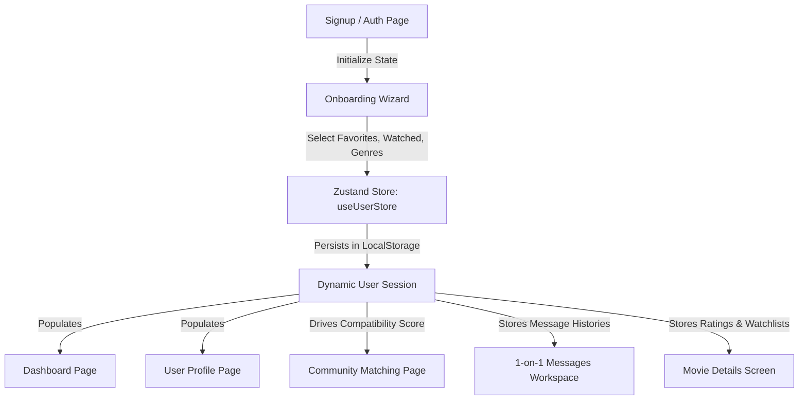

# CINELITH MVP Architecture, Directory Structure & Flow Documentation

This document describes the high-fidelity UI and client-side architecture of the **CINELITH** web application. It acts as the comprehensive guide for developers to understand the project's layout, data flow, page routing, and key subsystems.

---

## 📁 Repository Directory Structure

The repository is modularly split into a `frontend` Vite + React client and a `backend` Node + Express server.

```text
CINELITH_WEB_APP/
├── frontend/                   # React + Vite Client
│   ├── src/
│   │   ├── components/         # Modular UI Layout Elements
│   │   │   ├── actor/          # Actor Profile components (ActorBanner, Filmography, etc.)
│   │   │   ├── dashboard/      # User Analytics, Rankings, and SummaryCards components
│   │   │   ├── movie/          # Cast, Discussion boards, and MovieHero components
│   │   │   ├── movies/         # Catalog search inputs and Grid filter lists
│   │   │   ├── ui/             # Core UI atoms (Button, inputs, etc.)
│   │   │   ├── Navbar.jsx      # Sticky responsive navigation bar
│   │   │   └── Footer.jsx      # Platform branding footer
│   │   ├── pages/              # Page-level route views
│   │   │   ├── ActorProfile.jsx# Actor timeline filmographies and facts
│   │   │   ├── Auth.jsx        # Glassmorphic Login/Signup forms & carousels
│   │   │   ├── Community.jsx   # Cinephile matching grids & profile modals
│   │   │   ├── Dashboard.jsx   # Main stats dashboard page
│   │   │   ├── Home.jsx        # Dynamic sections landing page
│   │   │   ├── Messages.jsx    # Split-column chat workspace
│   │   │   ├── MovieDetails.jsx# Dynamic movie specifications & discussions
│   │   │   ├── Movies.jsx      # Central explore catalog grid search page
│   │   │   ├── Onboarding.jsx  # 5-step onboarding preference questionnaire
│   │   │   └── Profile.jsx     # User lists (Wishlists, likes, rates, stats)
│   │   ├── store/
│   │   │   └── useUserStore.js # Zustand state store with localStorage persistence
│   │   ├── App.jsx             # React router paths & guards
│   │   ├── main.jsx            # Entry point mount
│   │   └── index.css           # Global typography, color schemes & styles
│   └── package.json            # Frontend dependency maps
└── backend/                    # Node.js + Express Server (For Sync Mode)
    ├── src/
    │   ├── config/             # Database connection setups
    │   ├── middleware/         # Session protectors & JWT decoders
    │   ├── models/             # Mongoose schemas (User schema with friends lists)
    │   ├── routes/             # REST APIs (Auth routes, user metrics)
    │   ├── services/           # TVDB metadata integrations
    │   └── server.js           # Server port list mount
    └── package.json            # Backend dependency maps
```

---

## 🎨 Premium Visual Theme & Styling

CINELITH utilizes **Tailwind CSS v4** to achieve a luxurious cinematic aesthetic:
* **Background Color**: `#08060d` (ultra-dark obsidian background) with subtle glassmorphic container headers (`bg-white/5 border border-white/10 backdrop-blur-md`).
* **Accents**: Gold gradients and solid tags (`#FACC15` and `#E2B710`) to focus user attention on achievements, call-to-actions, and ratings.
* **Badges & Tags**: HSL tailored dark-green alerts for watched ticks, and semi-transparent badges for sub-genre lists.
* **Micro-Animations**: Linear gradient sweeps, active star-scale bounces, and slide-in modals using Framer Motion classes.

---

## 🔄 Client-Side Data & Flow Architecture

To accommodate offline local testing and maintain maximum visual fidelity, the system operates on a state-driven client simulator:



### 1. State Store (`useUserStore.js`)
Serves as the Single Source of Truth for:
* **User Profile**: Current user details, bio, avatar, liked movies, watchlist, and watched lists.
* **Catalogs**: Central seeded array representing 17 popular films, 8 actors, and 11 genres.
* **Chat Logs**: Maps friend usernames to array logs of sent/received text messages.
* **Followings**: Tracks contacts currently followed.
* **Actions**: Handles logging in, signup, onboarding saves, toggling watchlist/watched/likes, submitting ratings (+15 points), adding reviews (+30 points), toggling follow states, and sending messages.

### 2. Activity Score Mechanics
Cinephile Score is recalculated dynamically:
* Mark as Watched: `+50` points.
* Add to Watchlist: `+20` points.
* Star Rating: `+15` points.
* Review/Comment: `+30` points.

### 3. Taste Compatibility Engine
Compatibility between the active user and community members is computed dynamically:
$$\text{Compatibility} = 60\% + (\text{Shared Genres} \times 10\%) + (\text{Shared Actors} \times 12\%)$$
Scores are capped at $99\%$ and update instantly if the active user changes their onboarding questionnaire parameters.

### 4. Interactive Chat Simulator
When the user submits a message, the `sendMessage` action:
1. Appends the sent message with timestamp.
2. Triggers a `setTimeout` (1.5s delay) to display a "typing..." bubble.
3. Randomly matches a text reply based on the character's movie taste (e.g., Liam talking about Christopher Nolan's scores or Sophia recommending Yorgos Lanthimos films).
4. Appends the response to the scrollable chat feed.

---

## 🚦 Navigation Paths & Guards

All routes are declared in `App.jsx` using `react-router-dom`:
* `/`: Landing screen displaying dynamic trending films and actor shortcuts.
* `/auth`: Authentication screen.
* `/onboarding`: Step-by-step preference wizard. Requires active login.
* `/dashboard`: Protected metrics page showing streaks, dynamic analytics, and rankings. Redirects to `/auth` if anonymous.
* `/profile`: Interactive profile showing list grids and calculated stats.
* `/movies`: Comprehensive browse screen with filters and searches.
* `/movie/:id`: Dynamic movie banner and discussion comments thread.
* `/actor/:id`: Dynamic actor filmography listing matching films.
* `/community`: Social finder with modals and match filters.
* `/messages`: Messaging console (with `?user=` search param listener).
* `/notifications`: Notifications log card panels.
