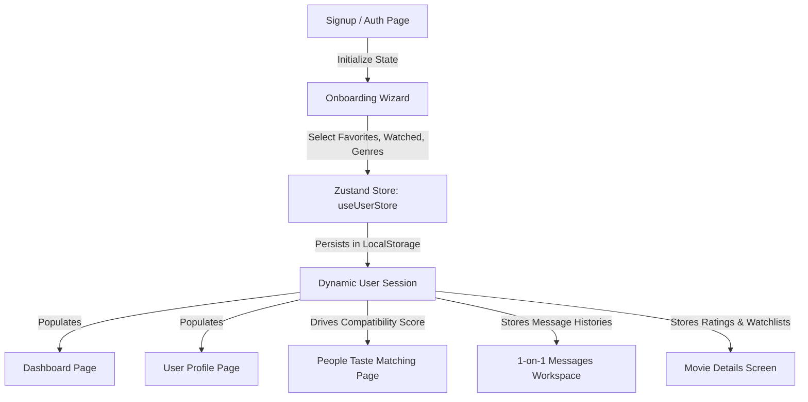

# CINELITH — Premium Cinematic Exploration & Social Platform

CINELITH is a premium, community-driven cinematic exploration platform. It allows users to search and discover films, track their watch history, vote in movie battles, test their film trivia knowledge, and connect with fellow cinephiles sharing overlapping tastes.

---

## 🚀 Getting Started

### Prerequisites
* **Node.js** (v18+)
* **npm** (v9+)

### Installation & Run

1. **Clone the repository**
   ```bash
   git clone https://github.com/CINELITH2025/CINELITH_WEB_APP.git
   cd CINELITH_WEB_APP
   ```
2. **Launch the Frontend Client**
   ```bash
   cd frontend
   npm install
   npm run dev
   ```
   Open [http://localhost:5173](http://localhost:5173) in your browser.

3. **Verify Production Build**
   ```bash
   npm run build
   ```

---

## 📁 Repository Directory Structure

The project directory structure is modularly split into layouts, home sections, actor bios, dynamic details, dashboard components, and state stores.

```text
CINELITH_WEB_APP/
├── README.md                   # Unified README and Developer Guide
├── frontend/                   # React + Vite Client Application
│   ├── src/
│   │   ├── components/         # Modular layout, landing, and page components
│   │   │   ├── actor/          # Actor profiles (ActorBanner, Filmography, AwardsSection)
│   │   │   ├── dashboard/      # Dashboard cards, dynamic Rankings, and Quiz games
│   │   │   ├── home/           # Landing page specific components (Hero banner, Sections)
│   │   │   ├── layout/         # Sitewide container wrappers (Navbar header, Footer)
│   │   │   ├── movie/          # Cast, comments boards, and dynamic MovieHero banner
│   │   │   └── ui/             # Core UI atoms (Glass buttons, inputs, Logo, etc.)
│   │   ├── pages/              # Route views (Home, Explore, ActorProfile, People, Dashboard, Profile, Auth)
│   │   ├── store/
│   │   │   └── useUserStore.js # Zustand store persistent in localStorage
│   │   ├── App.jsx             # React routing endpoints & state checks
│   │   └── index.css           # Tailwind custom tokens & styles
│   └── package.json            # Client dependency maps
└── backend/                    # Node.js + Express API Server
    ├── src/
    │   ├── config/             # DB connections
    │   ├── models/             # Mongoose schemas
    │   └── server.js           # Server routes
```

---

## 🔄 Client-Side Data & Flow Architecture

To accommodate offline local testing and maintain maximum visual fidelity, the system operates on a state-driven client simulator:



### 1. Central State Store (`useUserStore.js`)
Serves as the single source of truth for:
* **User Session**: Authentication status (`isAuthenticated`), user bio, custom avatar, liked list, watched history, and wishlist.
* **Movie & Actor Catalogs**: 17 curated films and 8 actors populated dynamically across pages (supporting both movies and TV shows).
* **Chat Message Logs**: Stores historical conversation logs per contact.
* **Following list**: Tracks followed users and follow requests (direct follow for public accounts, request sent status for private accounts).

### 2. Personalization & Onboarding Flow
Upon signing up, the user completes a 4-step onboarding wizard (`Onboarding.jsx`) to establish their baseline profile. Onboarding completion redirects the user immediately to `/dashboard` to populate their custom metrics.

### 3. Taste Compatibility Engine
Compatibility scores between the active user and community members are calculated dynamically based on overlaps:
$$\text{Compatibility} = 55\% + (\text{Shared Genres} \times 10\%) + (\text{Shared Actors} \times 12\%) + (\text{Shared Movies} \times 15\%)$$
Scores are capped at $99\%$.

### 4. Interactive Chat Simulator
Sending a message to a contact in the **Messages workspace** (`Messages.jsx`):
1. Appends the sent text message to the local log.
2. Triggers a typing bubble delay.
3. Automatically responds after 1.5s with a randomized, movie-themed chat reply tailored to that contact's profile.

---

## 🎨 Premium Visual Theme & Styling

CINELITH utilizes **Tailwind CSS v4** to achieve a luxurious cinematic aesthetic:
* **Branding**: Utilizes the final **3D Gold Wordmark Logo** (`logo_text.jpg`) blended seamlessly into obsidian backgrounds via CSS `mix-blend-screen`.
* **Background Color**: `#08060d` (obsidian black) with glassmorphic container grids (`bg-white/5 border border-white/10 backdrop-blur-md`).
* **Accents**: Gold solid fills and glowing border gradients (`#FACC15` and `#E2B710`).
* **Micro-Animations**: Scale hover transitions on movie card clicks, slide-in page models, and active button scaling.

---

## 🚦 Site Route Registry & Guards

* `/` (Home): Dynamic landing dashboard containing carousels and personalized banners.
* `/auth` (Auth): Login/signup form panel. Includes a "Back to Home" option.
* `/onboarding` (Onboarding): Preference wizard.
* `/dashboard` (Dashboard): Protected dashboard featuring onboarding favorites carousels, dynamic persona metrics, rankings, genre distribution charts, daily movie battles, and trivia quizzes.
* `/explore` (Explore): Merged Movie and TV show browse grid with global search and custom searchable combobox dropdown filters.
* `/movie/:id` (MovieDetails): Movie specifications, ratings widget, and discussion forums.
* `/actor/:id` (ActorProfile): Biography facts, awards logs, and actor filmography links.
* `/people` (People): Taste match percentages, suggested users, user search, custom filters, and follow requests.
* `/messages` (Messages): Workspace chats with dynamic user search.
* `/notifications` (Notifications): Community metrics tracker log.
* `/profile` (Profile): User collections (Liked Movies, Wishlist, My Reviews), profile editing modal, and **Your Lists** custom collection CRUD panels.
