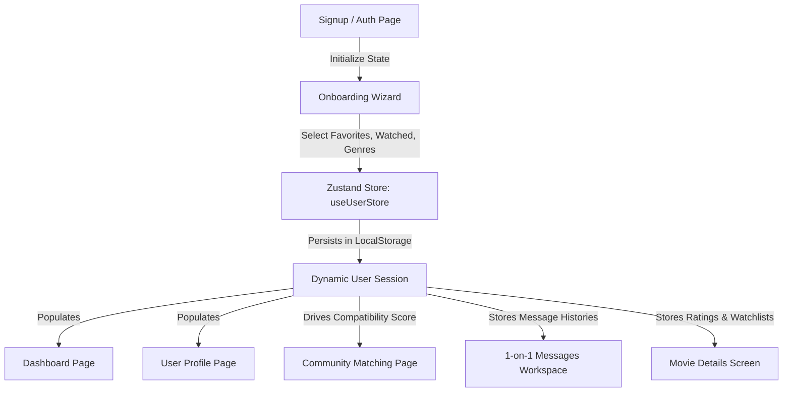

# CINELITH — Premium Cinematic Exploration & Social Platform

CINELITH is a premium, community-driven cinematic exploration platform. It allows users to search and discover films, track their watch history, vote in movie battles, test their film trivia knowledge, and chat with fellow cinephiles sharing overlapping tastes.

---

## 🚀 Getting Started

### Prerequisites
* **Node.js** (v18+)
* **npm** (v9+)

### Installation & Run

1. **Clone the repository**
   ```bash
   git clone https://github.com/CINELITH2025/CINELITH_WEB_APP.git
   cd CINELITH_WEB_APP
   ```
2. **Launch the Frontend Client**
   ```bash
   cd frontend
   npm install
   npm run dev
   ```
   Open [http://localhost:5173](http://localhost:5173) in your browser.

3. **Verify Production Build**
   ```bash
   npm run build
   ```

---

## 📁 Repository Directory Structure

The project directory structure is modularly split into layouts, home sections, actor bios, dynamic details, dashboard components, and state stores.

```text
CINELITH_WEB_APP/
├── ARCHITECTURE.md             # Architecture overview guide
├── README.md                   # Unified README and Developer Guide
├── frontend/                   # React + Vite Client Application
│   ├── src/
│   │   ├── components/         # Modular layout, landing, and page components
│   │   │   ├── actor/          # Actor profiles (ActorBanner, Filmography, AwardsSection)
│   │   │   ├── dashboard/      # Dashboard cards, dynamic Rankings, and Quiz games
│   │   │   ├── home/           # Landing page specific components (Hero banner, Sections)
│   │   │   ├── layout/         # Sitewide container wrappers (Navbar header, Footer)
│   │   │   ├── movie/          # Cast, comments boards, and dynamic MovieHero banner
│   │   │   ├── movies/         # Advanced search inputs & explore catalog filter grids
│   │   │   └── ui/             # Core UI atoms (Glass buttons, inputs, etc.)
│   │   ├── pages/              # Route views (Home, Movies, ActorProfile, Community, etc.)
│   │   ├── store/
│   │   │   └── useUserStore.js # Zustand store persistent in localStorage
│   │   ├── App.jsx             # React routing endpoints & state checks
│   │   └── index.css           # Tailwind custom tokens & styles
│   └── package.json            # Client dependency maps
└── backend/                    # Node.js + Express API Server
    ├── src/
    │   ├── config/             # DB connections
    │   ├── models/             # Mongoose schemas
    │   └── server.js           # Server routes
```

---

## 🔄 Client-Side Data & Flow Architecture

To accommodate offline local testing and maintain maximum visual fidelity, the system operates on a state-driven client simulator:



### 1. Central State Store (`useUserStore.js`)
Serves as the single source of truth for:
* **User Session**: Authentication status (`isAuthenticated`), user bio, custom avatar, liked list, watched history, and wishlist.
* **Movie & Actor Catalogs**: 17 curated films and 8 actors populated dynamically across pages.
* **Chat Message Logs**: Stores historical conversation logs per contact.
* **Following list**: Tracks followed users.

### 2. Personalization & Onboarding Flow
Upon signing up, the user completes a 5-step onboarding wizard (`Onboarding.jsx`) to establish their baseline profile. Results populate the dashboard summary cards, rankings, and analytics immediately.

### 3. Taste Compatibility Engine
Compatibility scores between the active user and community members are calculated dynamically based on overlaps:
$$\text{Compatibility} = 60\% + (\text{Shared Genres} \times 10\%) + (\text{Shared Actors} \times 12\%)$$
Scores are capped at $99\%$ and update instantly if the active user retakes the onboarding questionnaire.

### 4. Interactive Chat Simulator
Sending a message to a contact in the **Messages workspace** (`Messages.jsx`):
1. Appends the sent text message to the local log.
2. Triggers a typing bubble delay.
3. Automatically responds after 1.5s with a randomized, movie-themed chat reply tailored to that contact's profile (e.g. Liam talking about Nolan, or Sophia arguing about Villeneuve).

---

## 🎨 Premium Visual Theme & Styling

CINELITH utilizes **Tailwind CSS v4** to achieve a luxurious cinematic aesthetic:
* **Background Color**: `#08060d` (obsidian black) with glassmorphic container grids (`bg-white/5 border border-white/10 backdrop-blur-md`).
* **Accents**: Gold solid fills and glowing border gradients (`#FACC15` and `#E2B710`).
* **Micro-Animations**: Scale hover transitions on movie card clicks, slide-in page models, and active button scaling.

---

## 🚦 Site Route Registry & Guards

* `/` (Home): Dynamic landing dashboard containing carousels and personalized banners.
* `/auth` (Auth): Login/signup form panel.
* `/onboarding` (Onboarding): Preference wizard.
* `/dashboard` (Dashboard): Protected dashboard featuring summary cards, rankings, genre distribution charts, daily movie battles, and trivia quizzes.
* `/movies` (Explore): Movie browse grid with dynamic search filtering and sorting dropdowns.
* `/movie/:id` (MovieDetails): Movie specifications, ratings widget, and discussion forums.
* `/actor/:id` (ActorProfile): Biography facts, awards logs, and actor filmography links.
* `/community` (Community): Taste match percentages, sorting indicators, and follow triggers.
* `/messages` (Messages): Workspace chats with dynamic user search.
* `/notifications` (Notifications): Community metrics tracker log.
